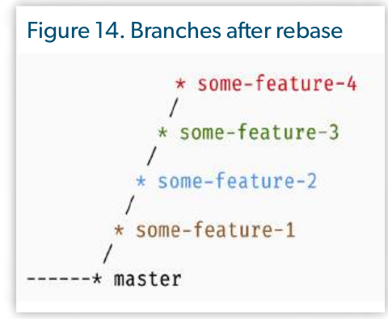

# How to Speed up the Code Review:

## Categories of Changes In a Pull Request
1. Fearutes/Functional Changes
- When we add new behivor to the system or change some existing behavior.

2. Structural Refactoring
- Changes to classes, interfaces, methods when we move some code between classes

3. Simple Refactoring

4. Renaming and moving classes

5. Remove unused (dead) code

6. Code style and formatting

The above sum up the 6 categories of a pull request and as such each category allows the code reviewer to focus on specific stratgey.

### Review Strategies

1. Features/Functional Changes

- check fulfillment of business requirement
- UnitTest verifications
- Reviewer checks the quality of the chosen solution
    - wrong design pattern applied
    - poor architecture (sending PN within request/response life cycle)
    - Writing business logic inside controller

2. Structural Refactoring

- Check backward compatibility. (Make sure none breaking behivor)
- The best way is to run tests (always required)

3. Simple Refactoring

- Improves the readability of the code (The Reviewer checks the readability of the code)

4. Renaming And Removing Classes

- The reviewer checks whether the namespace has become better.
- It is about project structuring and naming conventions
- When touching legacy, when we move legacy classes then it should be different PR

5. Removing Unused Code

- Check backward compatibility 
- Unit Test are invaluable 

6. Code Style and Formatting Fixes

- This should be automated via IDE or external tools like PHP CodeSniffer

### Time And Effort:

- Feature/Functional Changes - the longest
- Structural refactoring - quicker than features
- Simple refactoring - 99% instant approval
- Renaming/moving classes - 99% instan approval
- Removing unused code - 99% instant approval
- code style and formatting - 99% instant approval

If we want to make the reviewer's life more comfortable, it's better to send changes from different categories in different pull requests.

### Solution:

- Atomic Commits
    - each commit solves separat subtask within one big task
- Interactive Rebas
    - `git rebase -i` 
    - some commits may be squashed, renamed. Makes the commit history attractive and readable

Imagine we had a new task that is of type Feature/Functional, the developer did some house keeping thus mixed different categories into the same pull request. Such pull reques would make the code review ineffecient and waste of time and effort on the reviewers end. However if the developer had followed the atomic commit principle then the developer can `git rebase -i` to squash commits and create different branches thus smaller pull requests.

- Before Rebase:

- After Rebase:

### Conclusion 

- Do not create huge pull requests with mixed categories of changes.
- The larger the pull request is, the more difficult it is for the reviewer.
- Have a meaning full description state which category the pull request is in.
- Always diff your code before submitting the PR.

